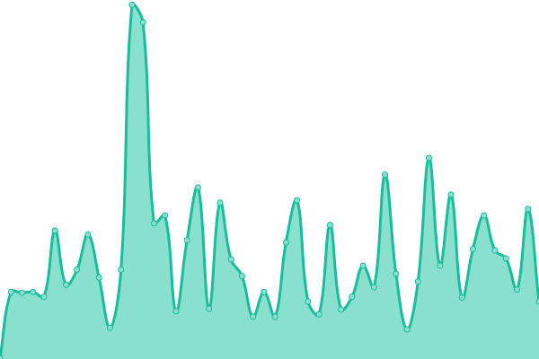
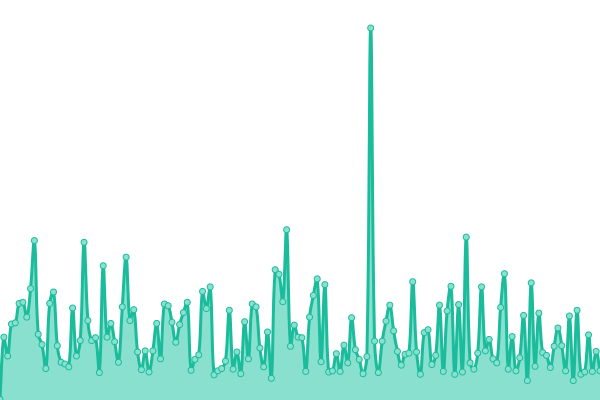
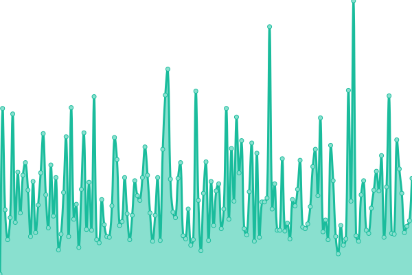

# [📈 Live Status](https://status.zulma.id): <!--live status--> **🟧 Partial outage**

This repository contains the open-source uptime monitor and status page for [Azhar Rizki Zulma](https://zulma.id), powered by [Upptime](https://github.com/upptime/upptime).

With [Upptime](https://upptime.js.org), you can get your own unlimited and free uptime monitor and status page, powered entirely by a GitHub repository. We use [Issues](https://github.com/AzharRizkiZ/Zulma-Status/issues) as incident reports, [Actions](https://github.com/AzharRizkiZ/Zulma-Status/actions) as uptime monitors, and [Pages](https://status.zulma.id) for the status page.

<!--start: status pages-->
<!-- This summary is generated by Upptime (https://github.com/upptime/upptime) -->
<!-- Do not edit this manually, your changes will be overwritten -->
<!-- prettier-ignore -->
| URL | Status | History | Response Time | Uptime |
| --- | ------ | ------- | ------------- | ------ |
|  [Zulma Landing Page](https://zulma.id) | 🟩 Up | [zulma-landing-page.yml](https://github.com/AzharRizkiZ/Zulma-Status/commits/HEAD/history/zulma-landing-page.yml) | 

 166ms
     
 | 

<a href="https://status.zulma.id/history/zulma-landing-page">88.98%</a>
    

|  [Zulma English](https://en.zulma.id) | 🟥 Down | [zulma-english.yml](https://github.com/AzharRizkiZ/Zulma-Status/commits/HEAD/history/zulma-english.yml) | 

 170ms
     
 | 

<a href="https://status.zulma.id/history/zulma-english">93.02%</a>
    

|  [Zulma Indonesia](https://id.zulma.id) | 🟩 Up | [zulma-indonesia.yml](https://github.com/AzharRizkiZ/Zulma-Status/commits/HEAD/history/zulma-indonesia.yml) | 

 137ms
     
 | 

<a href="https://status.zulma.id/history/zulma-indonesia">90.48%</a>
    

|  [Zulma Japan](https://jp.zulma.id) | 🟩 Up | [zulma-japan.yml](https://github.com/AzharRizkiZ/Zulma-Status/commits/HEAD/history/zulma-japan.yml) | 

 158ms
     
 | 

<a href="https://status.zulma.id/history/zulma-japan">89.53%</a>
    

|  [Zulma Blog](https://blog.zulma.id) | 🟩 Up | [zulma-blog.yml](https://github.com/AzharRizkiZ/Zulma-Status/commits/HEAD/history/zulma-blog.yml) | 

 135ms
     
 | 

<a href="https://status.zulma.id/history/zulma-blog">93.35%</a>
    

|  [Al-Jazari Personal Virtual Assistant](https://al-jazari.zulma.id) | 🟩 Up | [al-jazari-personal-virtual-assistant.yml](https://github.com/AzharRizkiZ/Zulma-Status/commits/HEAD/history/al-jazari-personal-virtual-assistant.yml) | 

 123ms
     
 | 

<a href="https://status.zulma.id/history/al-jazari-personal-virtual-assistant">90.97%</a>
    

<!--end: status pages-->

[**Visit our status website →**](https://status.zulma.id)

## 📄 License

- Powered by: [Upptime](https://github.com/upptime/upptime)
- Code: [MIT](./LICENSE) © [Anand Chowdhary](https://anandchowdhary.com), supported by [Pabio](https://pabio.com)
- Data in the `./history` directory: [Open Database License](https://opendatacommons.org/licenses/odbl/1-0/)
